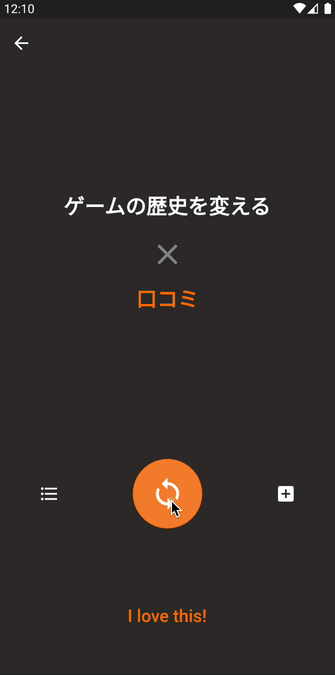
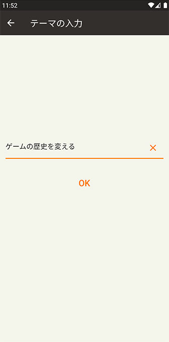

# &#x1f4a9; Idea Generator

This software is for my learning of Flutter.

With combining your theme with random keywords, you might be inspired and able to generate some good ideas. Once you got good ideas, keep it so that you can see it whenever you want.



## Home

This screen is your home. Your ideas will all show up as cards here. You can check you idea's summary by clicking and flipping card or add it to favorites, filter by text or tag.


You can filter your ideas by text. It's real-time filtering so stress-free experience is guaranteed.


Filtering by tags is also available. It's, of course, possible to combine with filtering by text.


In drawer menu, there are your favorites. Click it if you want to edit or see detail of that idea. To remove it from favorites, just swipe it.


To remove cards, just long-press a card and click its delete button.


## Input your theme

To generate your idea, at first, you have to input your theme. It may be your dream, favorite, goal or something like that.



## Get inspirations

By clicking a button, keywords appear randomly. If you got any inspiration from a combination, click "I love this!" button so that you can keep your amazing idea.


Every keywords have categories. You can on and off categories to control whether keywords belongs that ones will appear or not on the generate-idea screen.


Besides, you can add your original keywords as you like. Added keywords will appear on generate-idea screen of course. To edit or remove it, swipe its tile and you can see action buttons.


## Detail you idea

After clicking "I love this!", edit-idea screen will appear. You can title your idea and write description, attach tags.


In addition to basic information above, you can add an image you like from camera or gallery on your phone.


Added image is viewable and removable anytime you want.


## Save you idea

Click "Save" on edit-idea screen and your idea will be saved and show up on home screen. If you added an image, it'll be shown on the card with your theme and keyword.


## Edit tags

You can add your original tags. To edit or remove it, swipe its tile and you can see action buttons.


## Customize built-in keywords

Built-in keywords are managed as a json file. You can edit this file and change keywords as you like. Categories can be edited too.

This software uses SharedPreferences as data storage so if you have used this software before, you might need to clear all data at first.

```
[root]/assets/keyword.json
[root]/assets/category.json
```

## Under development

- data perpetuation
- data migration

## Licence

MIT © takanopontaro
